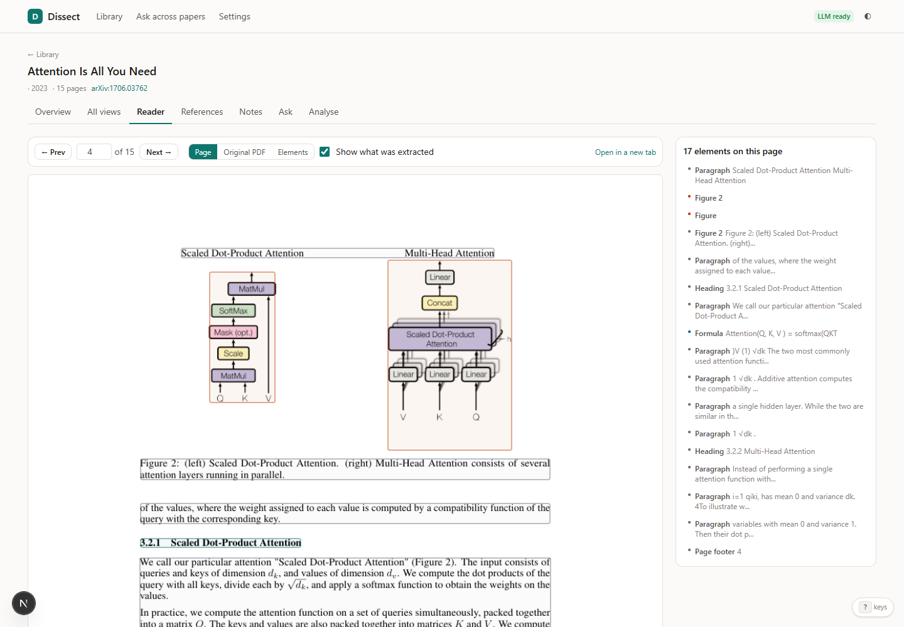
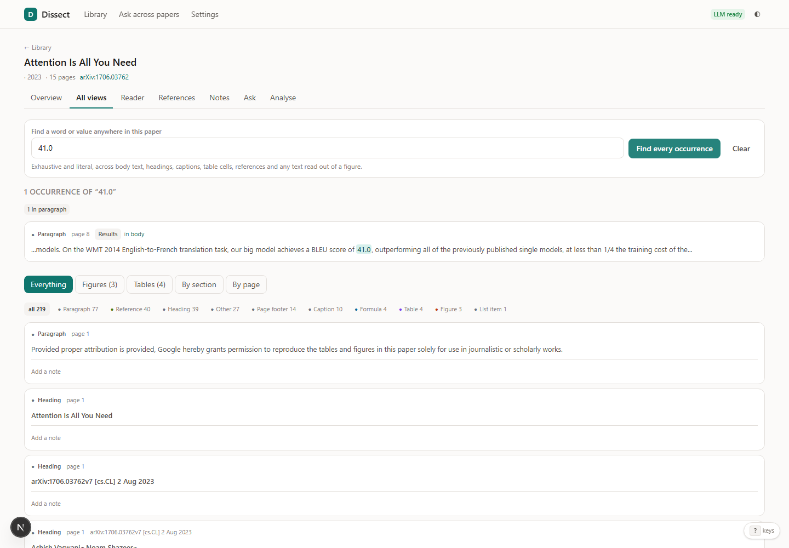
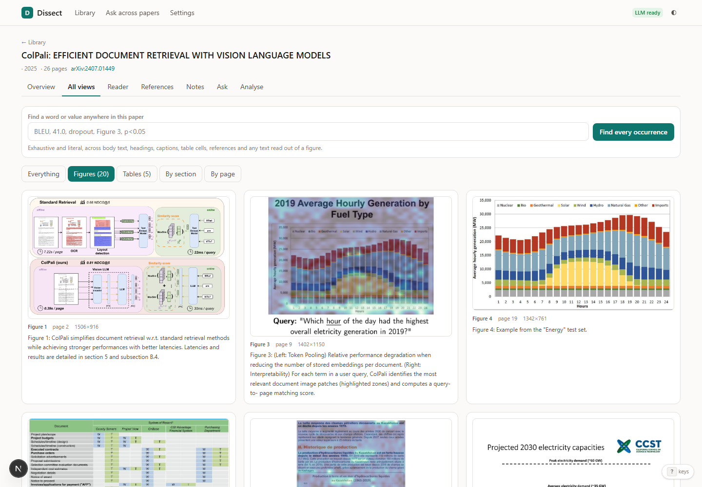
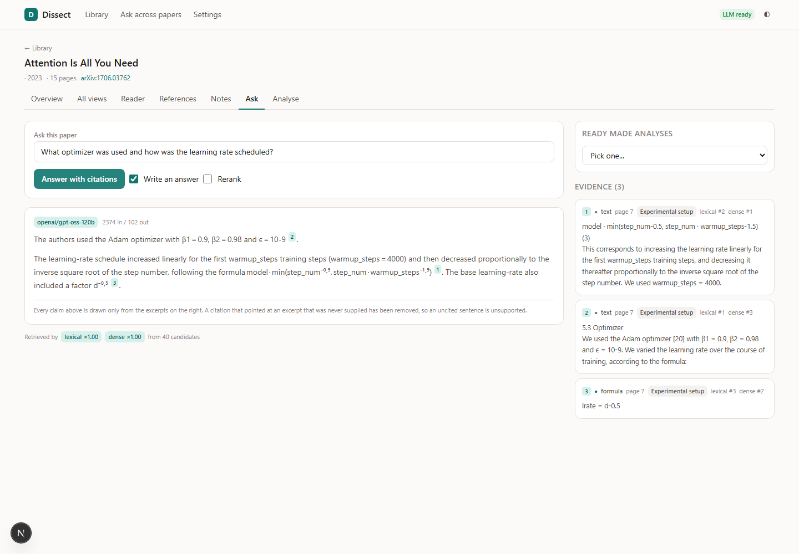
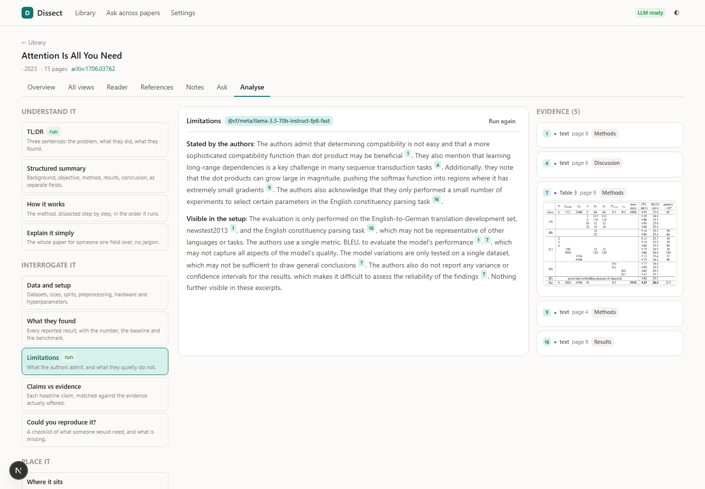
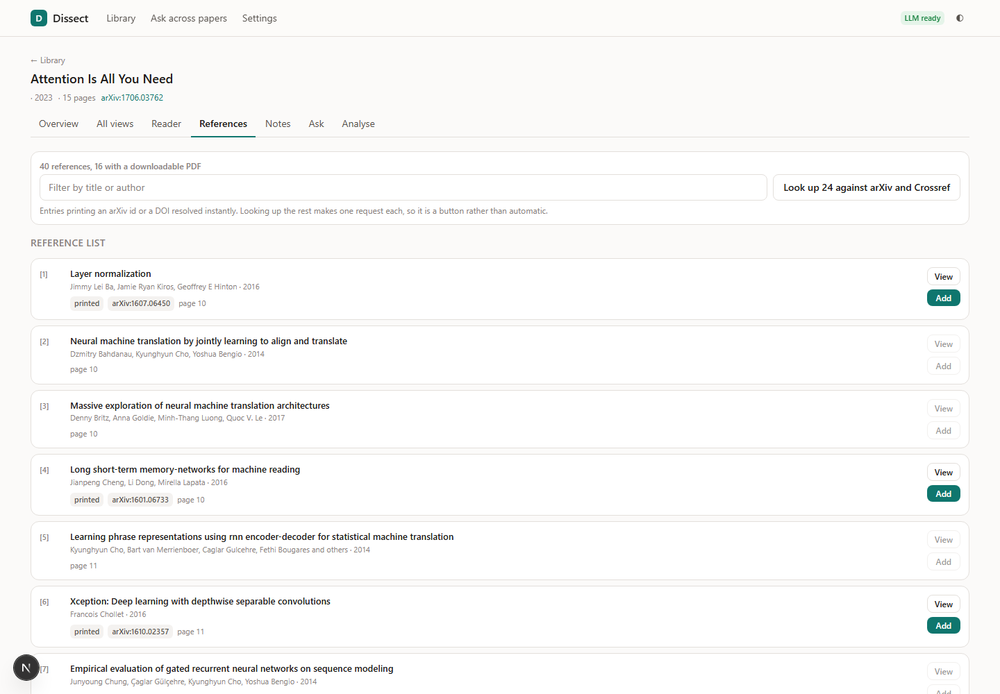
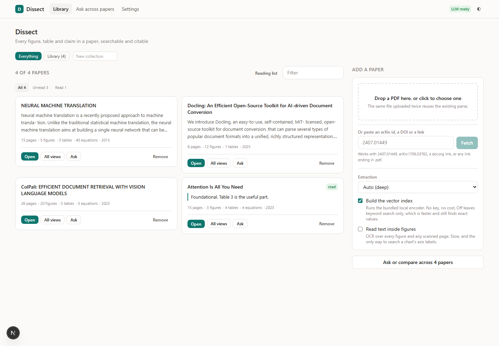

# Dissect

Upload a research paper and interrogate every figure, table, equation and claim
in it, with citations that point at a bounding box on a page.

It works with no API key at all. Parsing, figure and table extraction, keyword
and semantic search, and the whole browsing surface are local and free. A model
key adds written answers and the analysis lenses on top of that, and is never
required.

**[Try it: dissect-sepia.vercel.app](https://dissect-sepia.vercel.app)**

The live instance runs the serverless tier, so the deep parser, OCR and
reranking report themselves unavailable there and everything else works. It
carries no model key: answers need one pasted in Settings, which is kept in
your browser and sent only to the provider it belongs to. Papers you add are
public to anyone who opens the link, and can be removed from the library again.


---

## Contents

- [What it does](#what-it-does)
- [Quick start](#quick-start)
- [The two extraction tiers](#the-two-extraction-tiers)
- [How the fast tier reads a table](#how-the-fast-tier-reads-a-table)
- [How display equations are found](#how-display-equations-are-found)
- [Design decisions worth knowing](#design-decisions-worth-knowing)
- [Screens](#screens)
- [Deploying](#deploying)
  - [Hosting on Vercel, step by step](VERCEL_HOSTING.md)
- [Model providers](#model-providers)
- [The eval](#the-eval)
- [Layout](#layout)

---

## What it does

**Extracts elements, not text.** A paper becomes rows: paragraphs, headings,
tables with their grids, figures with their images, display equations,
captions, footnotes, references. Each carries its page, bounding box, reading
order and the heading trail it sits under. Everything else in the application,
retrieval, citation, the galleries and the reader overlay, reads those same
rows, which is why a citation can always point back at a real region of a real
page.

**Hybrid retrieval that finds numbers.** BM25 over a tokeniser that keeps
`41.0`, `BLEU-4`, `p<0.05` and `10^-4` whole, fused with dense cosine over a
local encoder using reciprocal rank fusion. Dense retrieval alone cannot tell
41.0 from 41.8, which is why asking a text-only RAG system for a score from a
results table so often fails. A question naming "Figure 3" or "Table 2" is
treated as an exact lookup and that element is pinned to the top, because
ranking it as a topic loses it: "figure" matches every figure in the paper.

**A no-LLM mode that is not a downgrade.** Ranked evidence with pages, scores
and a per-leg breakdown of why each result ranked where it did. It answers
"where in this paper is X" exactly, costs nothing, and is the default when no
model is configured.

**All Views.** Every element browsable by kind, by section, by page, or as a
figure gallery and a table browser. Plus an exhaustive literal search across
body text, headings, captions, table cells, reference strings and any text OCR
read out of a figure, telling you which part of each element matched.

**A reader that shows you the parse.** The real page, rendered server side,
with every extracted element outlined on it. A table whose columns are wrong, a
figure cropped badly, a heading that was missed, all become obvious the moment
the boxes are drawn. Switch to the original PDF inline when you want selectable
text and the browser's own search.

**Answers stream.** Evidence appears the moment retrieval finishes, then the
answer is written into the page. The credibility lens took 112 seconds to
return in silence before this.

**Figures reach the model as images.** A retrieved figure is attached to the
request as an actual image when the provider can take one, so a question about
a chart is answered by reading the axes rather than by paraphrasing the
caption. A text-only model silently gets the caption and OCR text instead, and
the answer says which happened.

**Add a paper from a link.** Paste `2407.01449`, a DOI or any PDF URL and it
fetches, parses and indexes. Server side fetching of a user supplied URL is a
request forgery primitive if built carelessly, so every host is resolved and
checked against the private ranges before connecting and again on each redirect
hop, and the response is accepted only if it actually starts with the PDF magic
bytes.

**References you can follow.** The reference list is split into individual
entries, matched to the in-text `[12]` and `(Smith et al., 2020)` markers that
point at them, and resolved against arXiv and Crossref. Each entry gets a
**View** button that opens the paper and an **Add** button that pulls it into
the library, but only where a freely downloadable PDF actually exists. You look
first and add what you choose, so the library never fills with things nobody
picked.

**Fifteen analysis lenses**, each a retrieval recipe plus a prompt: TL;DR,
structured summary, how it works, data and setup, what they found, limitations,
claims vs evidence, could you reproduce it, where it sits, jargon, explain it
simply, read the figures, and three that compare papers side by side. The ones
under "Interrogate it" exist because what separates a paper you can trust from
one you cannot is almost never in the abstract.

**Run one lens over the whole library.** "Limitations" across ten papers, one
at a time, each result appearing as it lands. A paper that already has that
lens returns instantly and says so, so re-running costs only what is new.

**Notes anchored to elements.** A note points at a figure, a table or a
paragraph, so it inherits that element's page and can be found again by where
it is rather than by memory.

**Extraction quality is scored.** The app already knew how well it parsed, and
never said. A per paper grade names the specific concerns: columns inferred
rather than read, pages with no text layer, figures recovered by cropping.

**Triage and a verdict.** Read state plus the one line you would tell a
colleague, because a library of fifty papers with no state becomes a junk
drawer within a month. Exported as a reading list.

**Keyboard driven.** `j` and `k` through elements, `/` to search, `h` and `l`
to turn pages, `o` for the overlay, `v` to cycle the reader's views, `?` for
the full list.

---

## Quick start

```bash
git clone https://github.com/spearb0lt/Research-Paper-Dissector && cd Research-Paper-Dissector

# Backend
uv venv --python 3.12 .venv          # or: python -m venv .venv
.venv/Scripts/activate               # Windows;  source .venv/bin/activate elsewhere
uv pip install -r requirements.txt
python scripts/fetch_model.py        # the bundled ONNX encoder, about 23 MB

# Frontend
npm install

# Two processes, in two terminals
npm run api                          # uvicorn on 127.0.0.1:8099
npm run dev                          # http://localhost:3099
```

No `.env` is needed to start. Copy `.env.example` to `.env` when you want to
add a model key.

Ports are pinned to **3099** (frontend) and **8099** (backend), away from the
usual 3000 and 8000 so this runs beside another project. Change them in
`package.json` and `next.config.mjs`, or point the dev proxy elsewhere with
`BACKEND_ORIGIN`.

Check what your machine can do:

```bash
python -m server.ops.cli doctor
```

Everything the UI does is also on the command line:

```bash
python -m server.ops.cli add paper.pdf --deep --ocr
python -m server.ops.cli search 1 "what was the BLEU score"
python -m server.ops.cli ask 1 "what are the limitations" --lens limitations
python -m server.ops.cli eval           # parser and retrieval regression eval
```

---

## The two extraction tiers

Nothing downstream of the parser knows which tier ran. That is what lets a
paper parsed deeply on a laptop be served from a deployment that could never
have parsed it.

| | **fast** | **deep** |
|---|---|---|
| Needs | PyMuPDF, pdfplumber, about 25 MB | Docling, PyTorch, about 2.5 GB |
| Runs on | anything, including serverless | a laptop, a VM, a container |
| Attention paper | 2.5s | 250s |
| Tables found | 4 of 4 | 4 of 4 |
| Nested table headers | no | yes |
| Figures found | 3 | 6 |
| Column structure | inferred from whitespace corridors | TableFormer |

Install the deep tier with:

```bash
pip install torch --index-url https://download.pytorch.org/whl/cpu
pip install -r requirements-server.txt
```

That also switches on OCR and cross-encoder reranking. Each capability reports
itself unavailable with a reason until it is installed, and the UI renders the
reason rather than a dead control.

### How the fast tier reads a table

Scientific papers overwhelmingly use booktabs style: horizontal rules above the
header, below it and at the foot, and no vertical rules at all. That defeats
every table finder that looks for intersecting lines, and the usual fallback of
inferring both axes from whitespace is worse than useless: pdfplumber and
PyMuPDF each turned page 3 of "Attention Is All You Need" into a 22 by 8 table
of word fragments, finding seventeen tables in a paper that has four.

So `server/parse/tables.py` groups aligned horizontal rules into bands, clusters
words into rows by vertical centre, and finds column boundaries by projecting
every word onto the x-axis and taking the corridors no word covers in
essentially any row. Measured against five hand-checked tables, including the
thirteen column ablation grid in the Transformer paper and the eleven column
benchmark table in ColPali, it gets the exact column count on four and splits
one column too many on the fifth. The constants were chosen by sweeping them
against those five, and `server/ops/eval.py` locks the result in.

A table whose structure it is unsure of is still emitted, with its region
rendered as an image and flagged in the UI, because a table you can see and a
vision model can read beats a table that silently went missing.

### How display equations are found

The obvious test, "does this line use a maths font", does not work. In a LaTeX
paper the body font and the maths fonts are mixed constantly inside ordinary
prose:

```
fonts=['CMMI10', 'CMMI7', 'NimbusRomNo9L-Regu']
'queries and keys of dimension dk, and values of dimension dv. We compute'
```

That is a sentence. What separates a display equation is that it contains *no
body text font at all*:

```
fonts=['CMMI10', 'CMMI7', 'CMR10']
'Attention(Q, K, V ) = softmax(QKT'
```

Both are from page 4 of the same paper. That test finds exactly the four
display equations in the Transformer paper with no false positives. The first
version of the detector found 27, because author footnote asterisks and the
`<pad>` and `<EOS>` tokens on the attention visualisation pages are also set in
no body font.

---

## Design decisions worth knowing

**No vector database.** A paper is a few hundred to a few thousand chunks. At
384 dimensions a numpy matmul against all of them is exact and sub-millisecond,
with no index to build and no service to run. Chroma was removed deliberately:
its HNSW backend serialises segment files per client, so two collections
sharing a directory leave one with metadata in SQLite and no segment files on
disk. Dropping it is also what makes the serverless tier possible.

**Contextual retrieval without the bill.** Anthropic's version prepends an
LLM-written sentence to each chunk and reports a large reduction in retrieval
failures. Most of what that sentence supplies is the chunk's position in the
document, which the parser already knows exactly. So each chunk gets its paper
title, heading trail and label prepended: deterministic, free, and it still
works with no key. The LLM-written version remains an opt-in.

**Chunks never cross a section boundary**, and a table or figure is never
split. A chunk that ends in Methods and begins in Results answers neither
question, and half a results table is how a system ends up able to find the
column headers or the numbers but never both.

**Citations are validated after generation.** A reference to an excerpt that
was never supplied is stripped, so a fabricated citation cannot reach the
screen looking like provenance. The claim survives visibly uncited, which is
the honest outcome. Models emit fullwidth and CJK brackets often enough that
those are normalised first, which they were previously walking straight past.

**Local embeddings are preferred over hosted ones even when a hosted key is
present**, and the bundled ONNX encoder specifically is the automatic choice
even over a better local model. Vectors from two backends are not comparable,
so whichever backend indexed a paper is the only one that can search it, and
the bundled model is the one backend present on every deployment tier. Ranking
by quality instead is a trap: installing the server extras adds
sentence-transformers, which scores higher, so the automatic choice silently
changes and every existing index stops being searchable.

**Pages are rendered on demand, not at ingest.** Measured on a 26 page paper:
38 ms and 227 KB per page at 1.5x, against 8.3 MB for the PDF itself. Rendering
eagerly is unnecessary rather than expensive, so a page is rendered the first
time someone opens it and content addressed thereafter.

**In development the browser talks to the backend directly.** Next's dev server
rewrite buffers server sent events: the answer stream delivered its first event
at 0.0s direct and at 19.0s through the rewrite, which makes streaming appear
broken in the one place it is being worked on. `NEXT_PUBLIC_API_BASE` is set to
the backend origin in development and empty in production, where Vercel serves
`/api` from the Python function on the same origin.

**ColPali and page-level visual retrieval were considered and rejected.** About
a thousand vectors per page, roughly 8 GB of VRAM, and a retrieval unit of a
whole page, which is coarser than the element-level extraction this already
has. Figures are found instead by their caption, their label, and OCR of the
text inside them, and are then read directly by a vision model.

---

## Screens

### The reader, with the parse drawn on the page

Every extracted element outlined on the real page: the figure in orange, the
headings in teal, the display equation in blue. If a box is in the wrong place,
the extraction is wrong there.



### All Views: find every occurrence

Not retrieval. Exhaustive and literal, across body text, headings, captions,
table cells, references and any text read out of a figure, saying which part of
each element matched.



### Figures, extracted with their captions



### Ask, with the evidence beside the answer

The evidence panel fills the moment retrieval finishes, before a word is
written. Each excerpt shows its page, its section, and which retrieval legs
found it and at what rank.



### Analyse: fifteen ready-made readings



### References, with View and Add



### The library



Regenerate every image in this README with `npm run capture`, which needs both
halves running and at least one paper in the library.

---

## Deploying

| Target | Tier | Notes |
|---|---|---|
| **Oracle Always Free** | everything | 4 ARM cores, 24 GB. The best free target by a distance. Use the Docker image. |
| **Docker / Compose** | everything | `docker compose up --build`, published on 8099 |
| **Render, standard** | deep parse, OCR, rerank | 2 GB. Blueprint in `render.yaml`. |
| **Render, free** | fast parse, BM25, local vectors | 512 MB is not enough for layout models, and a free instance cannot mount a disk, so uploads live in `/tmp`. Both report themselves rather than failing. |
| **Vercel** | fast parse, BM25, local vectors | 500 MB function limit. Needs `DATABASE_URL`: each instance has its own empty `/tmp`, so PDFs and figures are stored in the database and the filesystem is only a cache. Without one, nothing outlives the request that uploaded it. Every step is in **[VERCEL_HOSTING.md](VERCEL_HOSTING.md)**. |

`server/runtime.py` detects the platform and decides what is possible. Adding a
hosting target means teaching `detect()` about it, not editing the parser.

**[VERCEL_HOSTING.md](VERCEL_HOSTING.md)** is the full runbook for the hosted
instance: first deployment, updating, rolling back, what to check afterwards,
and the mistakes that cost a working deployment the first time.

### Storage, where there is no disk

A serverless instance has its own empty `/tmp`, so PDFs, figure crops and
cached page renders are written to the database instead and the filesystem is
only a read cache in front of them. `GET /api/health` reports the total and
whether it is in the database, which is the number to watch against a free
Postgres quota.

Storage is content addressed, so a blob belongs to no single paper and cannot
be deleted with one. Removing a paper therefore sweeps afterwards for blobs
that no surviving paper refers to, through the PDF digest, the per page render
digests and every figure element, and the response says how much it freed. A
re-parse or a failed ingest can also strand bytes, so the same sweep is
available on its own:

    python -m server.ops.cli gc

Measured on the live instance: "Attention Is All You Need" costs 2.8 MB, and
ColPali costs 31 MB because it has twenty figures and a large page count.
Removing a paper returns all of it.

---

## Model providers

Nineteen, through one adapter layer: Gemini, Anthropic, OpenAI, Groq,
OpenRouter, Together, DeepSeek, Mistral, Cerebras, SambaNova, xAI, Fireworks,
Perplexity, Hugging Face, Cloudflare Workers AI, and Ollama, LM Studio,
llama.cpp and vLLM locally. Seventeen speak the OpenAI protocol, thirteen
hosted and four local, so one client library covers all but Gemini and
Anthropic.

A key can come from the server's environment or from the browser. A key pasted
in Settings is stored in localStorage, attached as a header to that visitor's
own requests, bound to a context variable for the lifetime of one request on
the server, and forgotten. It is never written to disk, never logged, and never
sent anywhere but the provider it is for. That is what makes a public
deployment cost its operator nothing.

Eleven embedding backends, with the bundled ONNX MiniLM as the default.

---

## The eval

`python -m server.ops.cli eval` checks the parser against hand-checked ground
truth and retrieval against known answer pages. It fetches three papers from
arXiv on first run and is self-contained after that.

```
attention    2.5s   4 tables   3 figures   219 elements
             p6   columns  4 (want  4)  ok
             p8   columns  5 (want  5)  ok
             p9   columns 13 (want 13)  ok
             p10  columns  3 (want  3)  ok
             formulas  4 (want 4 to 4)
colpali      5.5s   5 tables  20 figures   455 elements
docling      1.2s   1 tables  12 figures   133 elements
             p5   columns  5 (want  5)  ok

retrieval (ingesting into a scratch database)
  ok    p[8] got p[8, 8, 1]   What BLEU score did the big model achieve on English
  ok    p[8] got p[8, 12, 7]  What is the dropout rate and label smoothing value?
  ok    p[7] got p[7, 8, 9]   What dataset did they train on?
  ok    p[6, 7] got p[6, 6, 10]  Why is self-attention faster than recurrent layers?
  ok    p[7] got p[7, 7, 8]   What optimizer and learning rate schedule were used?
  ok    p[3] got p[3, 4, 3]   What does Figure 1 show?
  ok    p[8] got p[8, 9, 6]   What is in Table 2?
  ok    p[4] got p[4, 3, 4]   Describe Figure 2

PASSED
```

Every assertion in it encodes a bug that was real and shipped at some point:
the shredded-prose tables, the caption bounding box that swallowed the table
below it, the duplicated vector figures, the string-versus-integer chunk ids
that stopped the two retrieval legs from ever fusing, and the label references
that could not find the figure they named.

---

## Layout

```
server/
  runtime.py        what this process is allowed to do, and why not
  settings.py       configuration, entirely from the environment
  blobs.py          content addressed storage for PDFs and images
  pages.py          page rendering, on demand and cached
  pipeline.py       store, parse, chunk, index
  refs.py           reference resolution against arXiv and Crossref
  fetch.py          ingest by arXiv id, DOI or URL, with SSRF guards
  export.py         CSV, Markdown, BibTeX
  parse/            base, fast, deep, tables, formulas, citations,
                    sections, quality, ocr, registry
  index/            chunk, lexical (BM25), dense, fuse (RRF), rerank
  ask/              retrieve, answer, lenses
  db/               engine (SQLite and Postgres), schema, repo
  llm/              19 providers, streaming, per-request keyring
  embeddings/       11 backends, ONNX default
  api/              routes, extras
  ops/              cli, eval, meter
app/                Next.js App Router
components/         shared React
lib/                API client, types, key vault
scripts/            fetch_model.py, capture.mjs
docs/media/         README screenshots and the demo recording
```

About 15,400 lines of Python and 7,000 of TypeScript, over 41 API routes.

---

## Licence

MIT.
